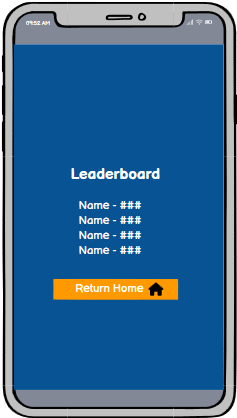
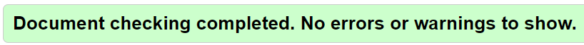
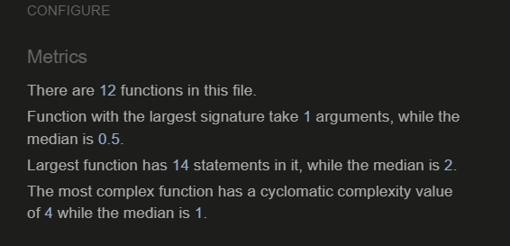

# Terry's General Knowledge Quiz Game

- Welcome to Terry's General Knowledge Quiz Game! This interactive quiz challenges players with 20 questions covering a wide range of topics. As you progress through the game, your score will be updated in real-time, allowing you to see how well you're doing after each question.

# UX

- The General Knowledge Quiz Game is designed to provide a seamless, engaging, and intuitive experience for players of all ages. The game flow, feedback mechanisms, and user interface have been carefully crafted to ensure that players can focus on the challenge of answering questions while enjoying a smooth and rewarding experience.

- Overall, the General Knowledge Quiz Game is designed to be engaging, easy to navigate, and rewarding, with a focus on clear feedback and a competitive edge through the leaderboard system.

## 1. Starting the Game

 - Welcome Screen: Players are greeted with a clean and inviting welcome screen featuring clear options to start the game or view the leaderboard.

 - Easy Navigation: The user interface is straightforward, with prominent buttons for starting the quiz, making it easy for users to begin.

## 2. Gampeplay Experieance

- Question Display: Each of the 20 questions is presented one at a time, with a simple and legible layout. The current question number and score are displayed at the top, keeping players informed of their progress.

- Real-Time Feedback: As players select answers, their score is immediately updated and displayed on the screen, providing instant gratification or motivation to improve.

- Clear Instructions: Instructions are minimal and intuitive, allowing players to focus on answering questions without unnecessary distractions.

## 3. End of Game and Scoring

- Final Score Display: At the end of the quiz, players see their final score prominently displayed, offering a moment of reflection on their performance.

- Name Entry Requirement: To save their score, players are prompted to enter their name. This step is mandatory, ensuring that the leaderboard remains personalized and competitive.

- Error Handling: If a player attempts to save their score without entering a name, a friendly reminder prompts them to do so.

## 4. Leaderboard and Replay Options

- Leaderboard Integration: After entering their name, players see their score added to the leaderboard. This page is designed to motivate players by showcasing top scores and encouraging them to aim higher.

- Play Again: From the leaderboard, players can easily choose to replay the quiz, offering an opportunity to improve their score and climb the rankings.

## 5. Responsive Design

- Mobile-Friendly: The game is optimized for various devices, ensuring that the experience is consistent and enjoyable whether played on a desktop, tablet, or smartphone.

## 6. 10 Seconds Timer On Each Question

__Acceptance Criteria:__

- __Timer Initialization:__

A countdown timer should start from 10 seconds as soon as each new question is presented to the user.
The timer should be visible to the user at all times during the quiz, clearly displaying the remaining time in seconds.

- __Timer Behaviour:__

If the user selects an answer before the 10 seconds expire, the timer should stop immediately.

If the timer reaches zero before the user selects an answer, the question should be automatically marked as incorrect, and the quiz should proceed to the next question.

- __Visual and UX Considerations:__

The timer should be prominently displayed in a way that doesn't obstruct the question or answer choices.

The countdown should be visually distinct and should clearly indicate when time is running out, possibly by changing color or flashing in the final seconds.

- __Scoring and Progress:__

The scoring system should remain consistent, with correct answers being rewarded regardless of how quickly they are selected within the 10-second window.

The quiz should continue to progress smoothly from one question to the next, whether the user answers within the time limit or the timer expires.

- __Edge Cases:__

Ensure that the timer resets correctly for each new question.

Handle scenarios where the user navigates away from the quiz or refreshes the page, ensuring that the timer and quiz state are appropriately managed.

# User Stories

- As a **user** I want **to easily start the quiz from the home screen** so that **I can quickly begin answering questions**.

- As a **user** I want **to see the current question number and my score as I progress through the quiz** so that **I can keep track of my performance**.

- As a **user**, I want **the quiz questions to be displayed clearly with multiple-choice options** so that **I can easily select my answers**.

- As a **user**, I want **to receive immediate feedback on my score after each question** so that **I can know how well I’m doing in real-time**.

- As a **user**, I want **to view my final score after completing the quiz** so that **I can reflect on my overall performance**.

- As a **user**, I want **to be required to enter my name before saving my score** so that **the leaderboard displays personalized entries**.

- As a **user**, I want **to see an error message if I try to save my score without entering my name** so that **I’m reminded to enter my name**.

- As a **user**, I want **to see the leaderboard with top scores after saving my score** so that **I can compare my performance with others**.

- As a **user**, I want **to see a progression bar** so that **I can easily track how many questions remain in the quiz**.

- As a **user**, I want **the quiz game to be accessible and responsive on various devices (e.g., desktop, tablet, mobile)** so that **I can enjoy the game on any device**.

- As a **site manager**, I want to **enhance the quiz application by introducing a 10-second timer for each of the 20 questions in the quiz** so that **I can increase the challenge and engagement level for users, making the quiz more dynamic and exciting while encouraging quick thinking and fair competition**.

# Features

- 20 Challenging Questions: Test your knowledge with a variety of questions from different subjects.

- 10 seconds timer on each question to help ensure fairness by providing a consistent time limit for each question, thereby enhancing the overall quality and competitiveness of the quiz.

- Real-Time Scoring: Your score is displayed as you answer each question, giving you instant feedback.

- Leaderboard Integration: At the end of the game, you'll be prompted to enter your name before saving your score to the leaderboard.

- Save and Compete: Your name and score are saved to a leaderboard, where you can see how you stack up against your individual previous attempts.

- Play Again: After completing the quiz, you can choose to play again and improve your score.

## High-Level Features

| **Home page** | **Quiz Page** | **End Page** |  **High Scores Page**  | 
|---|---|---|---|
| Welcome  Page displaying prompt message and two navbars to play or view top scores  | Quiz Game containing 20 multiple choice questions with a 10 seconds timer, progess bar and a score update after each correct answer  | Final Score displayed with *Name requirement* to save score and additional navbars to either play again or return home  |  Leaderboard Displaying top 5 highscores with respective player names  |

|  **Features**  |  **Value**  | **Effort**  |
|---|---|---|
| Home Page  |  High  | low  |
| Quiz Page  | High |  High  |
| End Page  | Medium | High |
| High Scores Page  | Medium | Low |
| Navbar  | High | High |

| Feature  |  Priority  |
|---|---|
| Home Page | 3 |
| Quiz Page  | 5 |
| End Page  | 4 |
| High Scores Page  | 3 |
| Navbar  | 5 |

### Site Wireframes

-__Home Page__

-__Quiz Game Page__

-__Submit Score or End Page__

-__Leaderboard or Top Scores Page__

## Surface

Favicon logo generated on: [Favicon Generator](https://favicon.io/logo-generator/)

### Design

The home icon and crown icons where used from the [Fontawesome library](https://fontawesome.com/)

### Selected Colors

__Application Background color__ - Dark Cerulean

__Home, End Page & High Scores Page Navabar color__ - Hot Pink or Deep Pink & Vivid Orange or Orange-Red Linear gradient 

__Application Handwritting color__ - White

__Progress Bar color__ - Green

__Question, Score and Answer color__ - White

__Correct Answer__ - Green

__Incorrect Answer__ - Red

__Answers Choice containter__ - Rust or Dark Orange

## Fonts

The "Ubuntu" cursive font was utilised in this application. Generated from [Google Fonts](https://fonts.google.com/?preview.layout=grid)

## Technologies Utilised

- HTML

- CSS3

- JavaScript

## Testing

- The quiz game has been tested on Safari, Opera, Chrome and Microsoft Edge

- The quiz game has been vigorously tested throughout the developmment process for responsiveness across various devices curtesy of the chrome developer tools.

- In order to make sure the application passes the background and foreground lightouse tests, contrast ratio checker was used to provide a sufficient contrast ratio between the background and foreground of the questions and the containers for better UX especially in aid of partially visual impaired users.

__Contrast Ratio Checker__ [Contrast Checker](https://webaim.org/resources/contrastchecker/)

### Validating

__HTML Home, Quiz, End Page & HighScores Page Validations:__

  - [HTML Validator Used](https://validator.w3.org/)

  

  

  

  

__CSS - Main Styles, Highscores & Game/Quiz Styles Validations:__

  - [CSS Validator Used](https://jigsaw.w3.org/css-validator/)

  

  

  

__JavaScript - Game, Highscores & End Page Validations:__

  - [JavaScript Validator Used](https://jshint.com/)

  

  

  

### Lighthouse testing tools were utilised to test each page of the website on both Desktop & Mobile views.

### Desktop View Lighthouse Scores:

__Home page - Desktop Scores__ 

__Quiz page - Desktop Scores__ 

__Submit score page - Desktop Scores__ 

__Leaderboard page - Desktop Scores__ 

### Mobile View Lighthouse Scores:

__Home Page Lighthouse Test Results__ 

__Quiz Page Lighthouse Test Results__ 

__End Page Lighthouse Test Results__ 

__Leaderboard page - Mobile Scores__ 

Lighthouse testing evaluates a website’s performance, accessibility, best practices, and SEO. Here’s why running these tests for this site was important:

*Performance:* Ensures the site loads quickly, enhancing user experience and retention.

*Accessibility:* Verifies that the site is usable by people with disabilities, broadening your audience.

*Best Practices:* Checks for code quality and security issues, reducing potential vulnerabilities.

*SEO:* Optimizes the site for search engines, increasing visibility and traffic.

## User Story Testing

__1__ - As a **user** I want **to easily start the quiz from the home screen** so that **I can quickly begin answering questions**.

- *Ease of Access:* Ensuring that the quiz can be easily started from the home screen is crucial for providing a smooth and intuitive user experience. If users have difficulty finding or starting the quiz, it can lead to frustration and potentially cause them to abandon the application.

- *First Impressions:* The home screen is often the first point of interaction users have with the quiz application. A clear, easily accessible start button ensures a positive first impression and encourages users to engage with the content.

__2__ - As a **user** I want **to see the current question number and my score as I progress through the quiz** so that **I can keep track of my performance**.

- *Progress Tracking:* Displaying the current question number helps users understand how far they have progressed in the quiz. This feature motivates users to continue, especially as they near the end of the quiz.

- *Real-Time Feedback:* Showing the score in real-time allows users to gauge their performance and encourages them to strive for better results. It adds an element of gamification, making the quiz more engaging and competitive.

__3__ - As a **user**, I want **the quiz questions to be displayed clearly with multiple-choice options** so that **I can easily select my answers**.

- *Clarity and Accessibility:* The primary function of a quiz is to present questions to users in a way that is easy to read and understand. Clear display of questions and options ensures that users can focus on answering rather than struggling to comprehend the content.

- *Intuitive Design:* A clear and intuitive interface enhances user engagement by making the quiz easy and enjoyable to interact with. This is essential for keeping users interested and encouraging them to complete the quiz.

__4__ - As a **user**, I want **to receive immediate feedback on my score after each question** so that **I can know how well I’m doing in real-time**.

- *Immediate Feedback Mechanism:* Testing this feature ensures that the feedback system works seamlessly without delays or errors, contributing to the overall functionality and user-friendliness of the quiz application.

- *User-Centric Design:* Providing real-time feedback aligns with user expectations in modern interactive applications. Ensuring this feature works correctly is crucial for meeting user needs and delivering a polished product.

__5__ - As a **user**, I want **to view my final score after completing the quiz** so that **I can reflect on my overall performance**.

- *Completion Feedback:* Providing a final score at the end of the quiz gives users a sense of closure and accomplishment. It's a crucial part of the user experience that helps users understand how well they performed overall, leaving them with a clear outcome.

- *Reflection and Learning:* Viewing the final score allows users to reflect on their performance, identify areas where they did well, and recognize where they need improvement. This reflective process is important for users who take quizzes for learning purposes.

__6__ - As a **user**, I want **to be required to enter my name before saving my score** so that **the leader board displays personalized entries**.

- *Identity and Ownership:* Requiring users to enter their names before saving their scores adds a personal touch, making the experience more engaging. It allows users to feel a sense of ownership over their performance, which enhances their connection to the quiz.

- *Authenticity:* Requiring a name entry before saving a score ensures that each score is authentic and traceable to a specific user. This reduces the likelihood of users attempting to manipulate the leaderboard with multiple anonymous entries.

__7__ - As a **user**, I want **to see an error message if I try to save my score without entering my name** so that **I’m reminded to enter my name**.

- *Enhanced User Experience:* Error messages are a critical part of user experience design. By providing immediate feedback on what went wrong, the application helps users correct their mistakes quickly, leading to a smoother and more intuitive interaction. In this application, the save button wont be clickable before user enters their name.

- *Preventing Incomplete Entries:* Requiring a name entry before saving a score ensures that all leaderboard entries are complete and personalized. This maintains the integrity and usefulness of the leaderboard, preventing it from being cluttered with anonymous or incomplete entries.

__8__- As a **user**, I want **to see the leaderboard with top scores after saving my score** so that **I can compare my performance with others**.

- *Seamless Navigation:* Automatically displaying the leaderboard after score submission streamlines the user experience, eliminating the need for users to navigate manually to view the leaderboard. This convenience enhances the overall flow and user satisfaction.

- *Informed Decision-Making:* Users can decide whether to take the quiz again to improve their ranking based on how they compare to the top scores, driving continued interaction with the quiz.

__9__- As a **user**, I want **to see a progression bar** so that **I can easily track how many questions remain in the quiz**.

- *Continuous Improvement:* Testing the progress bar feature is important because it enhances the user experience by providing a visual indicator of quiz progression. This feedback helps users manage their time and maintain engagement by knowing how far they are into the quiz and how many questions remain. Ensuring that the progress bar functions correctly is crucial for maintaining user satisfaction and a seamless quiz experience.

__10__ - As a **user**, I want **the quiz game to be accessible and responsive on various devices (e.g., desktop, tablet, mobile)** so that **I can enjoy the game on any device**.

- *Broad Reach:* Ensuring that the quiz game works well across different devices maximizes its reach and accessibility. Users access content from a variety of devices, and accommodating this diversity ensures that the game is available to the widest audience.

- *Enhanced Usability:* Responsive design ensures that all interactive elements (buttons, menus, etc.) are appropriately sized and functional on different devices. This enhances usability and encourages users to play the game more frequently.

__11__ - As a **site manager**, I want to **enhance the quiz application by introducing a 10-second timer for each of the 20 questions in the quiz** so that **I can increase the challenge and engagement level for users, making the quiz more dynamic and exciting while encouraging quick thinking and fair competition**.

- *Dynamic Experience:* Implementing a 10-second timer adds an element of urgency and excitement to the quiz, making it more dynamic and engaging. This time constraint encourages users to think quickly, adding a layer of challenge that can make the game more thrilling.

- *Equal Opportunity:* Setting a uniform timer for all users ensures that everyone faces the same time constraints, promoting fairness in competition. This standardization helps level the playing field and ensures that scores are based on skill and knowledge, rather than timing advantages.

### Features For Future Implementation

The below features can significantly enhance the user experience and engagement with the quiz game, offering more variety, challenge, and interactivity.

 __Question Categories__

- Description: Allow users to select specific categories of questions (e.g., History, Science, Entertainment) before starting the quiz, providing a more tailored experience.

__Difficulty Levels__

- Description: Implement varying difficulty levels (Easy, Medium, Hard) that users can choose from. This could involve more challenging questions or stricter time limits for harder levels.

 __Hint System__

- Description: Add a hint system that allows users to spend points or take a penalty to receive hints or eliminate incorrect answers for particularly tough questions.

 __Multiplayer Mode__

- Description: Develop a multiplayer mode where users can compete against friends or other players online in real-time, seeing who can answer the most questions correctly within a time limit.

__Social Sharing of Scores__

- Description: Integrate social media sharing options, allowing users to post their final scores to platforms like Twitter or Facebook, challenging friends to beat their high scores.

 __Progressive Difficulty__

- Description: Implement a system where the difficulty of questions increases as the player progresses through the quiz, maintaining a challenging experience throughout.

 __Achievements and Badges__

- Description: Introduce a system of achievements and badges that players can earn for reaching certain milestones, such as answering all questions correctly, achieving a streak of correct answers, or completing a certain number of quizzes.

 __Audio and Visual Feedback__

- Description: Enhance the game experience with sound effects and animations that respond to correct or incorrect answers, as well as dynamic transitions between questions.

 __In-Depth Analytics__

- Description: Provide users with detailed analytics at the end of the quiz, such as their accuracy percentage, time taken per question, and performance trends over multiple games.

## Known Issues and Bugs

__1__ - __Inconsistent Score Display__

- Description: Occasionally, the score may not update correctly during the quiz, showing the previous score instead of the updated one.

- Workaround: Refresh the page to reset the game. If the issue persists, clear your browser’s cache and try again.

__2__ - __Name Field Validation__

- Description: The game may allow users to attempt to save their score without entering a valid name, especially if the name field is autofilled by the browser.

- Workaround: Ensure that users manually input their names before attempting to save their scores.

__3__ - __Leaderboard Duplication__

- Description: In rare cases, the same score may appear multiple times on the leaderboard if the save button is clicked multiple times rapidly.

- Workaround: Avoid clicking the save button multiple times. If duplication occurs, refresh the page to view the correct leaderboard.

__4__ - __Responsive Design Issues on Small Screens__

- Description: On some small mobile devices, the game elements may not be perfectly aligned or may require excessive scrolling.

- Workaround: Adjust the zoom level of the browser or try switching to landscape mode for better visibility.

__5__ - __Slow Performance on Older Browsers__

- Description: The game may experience slow performance or lag when played on older web browsers, particularly those that do not fully support modern JavaScript or CSS features.

- Workaround: Use the latest version of Chrome, Firefox, Safari, or Edge for the best experience.

__6__ - __Form Submission Delays__

- Description: After entering their name and clicking the save button, users may experience a delay before the leaderboard updates.

- Workaround: Please wait a few seconds after submitting. If the delay persists, check your internet connection.

__7__ - __Navigation Issues on Some Mobile Devices__

- Description: Users on certain mobile devices may find it difficult to navigate back to the home page or restart the game after finishing the quiz.

- Workaround: Use the browser’s back button or manually refresh the page to restart the game.

__8__ - __Missing or Incorrect Icons__

- Description: In some cases, the Font Awesome icons used on buttons (such as the home or crown icons) may not display correctly.

- Workaround: Ensure a stable internet connection as the icons are fetched from an external CDN. Try clearing the browser cache if the problem persists.

__9__ - __Progress Bar Display Issues__

- Description: The progress bar that shows how many questions have been answered may not fill up correctly if the browser window is resized during the game.

- Workaround: Avoid resizing the browser window during gameplay. If this issue occurs, refresh the page to reset the game.

__10__ - __Local Storage Limits__

- Description: The leaderboard data is stored in the browser's local storage, which has size limitations. Over time, this may cause issues with saving new scores.

- The timer function inclusion also helps on potential timeout and session timeout issues.

- Workaround: Clear your browser’s local storage periodically, but be aware that this will also delete your saved leaderboard data.

## Deployment

[Deployed Project Link](https://terencetamuka.github.io/individual-fullstack-project/)

### Credits

Credit to stack overflow on understanding certain concepts used in this project.

- Chat GPT with suggesting questions included in the game.

- Watched tutorials for HTML, CSS & JavaScript concepts used in this project on [Bro Code Youtube Channel](https://www.youtube.com/@BroCodez)

### Terry's General Knowledge Quiz Game Designed by

Terence Zengeya
